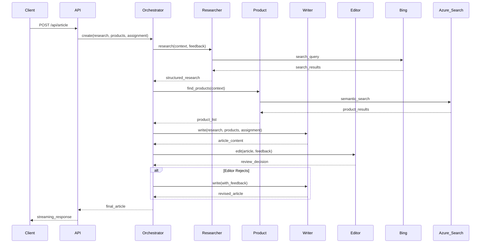
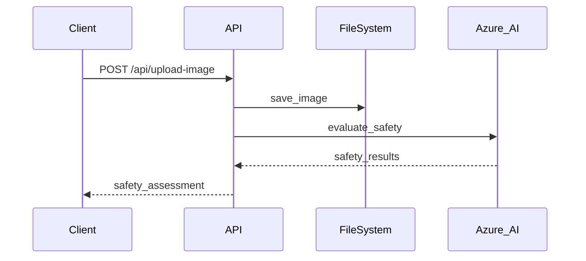

# Contoso Creative Writing Assistant - Technical Documentation

## Overview

The Contoso Creative Writing Assistant is a multi-agent AI system that creates well-researched, product-specific articles using Azure OpenAI services. The system orchestrates multiple specialized agents to research topics, find relevant products, write articles, and edit content to produce high-quality output.

## Architecture

The system follows a microservices architecture with the following components:

### Core Components

1. **FastAPI Web Server** (`main.py`) - Main entry point and API gateway
2. **Orchestrator** (`orchestrator.py`) - Coordinates agent workflows
3. **Agent Services** - Specialized AI agents for different tasks
4. **Evaluation System** - Content safety and quality assessment

### Agent Architecture

The system implements four main agents:

```
┌─────────────────┐    ┌─────────────────┐    ┌─────────────────┐    ┌─────────────────┐
│   Researcher    │───▶│   Product       │───▶│    Writer       │───▶│    Editor       │
│     Agent       │    │     Agent       │    │     Agent       │    │     Agent       │
└─────────────────┘    └─────────────────┘    └─────────────────┘    └─────────────────┘
        │                       │                       │                       │
        ▼                       ▼                       ▼                       ▼
┌─────────────────┐    ┌─────────────────┐    ┌─────────────────┐    ┌─────────────────┐
│  Bing Search    │    │  Azure AI       │    │  Azure OpenAI   │    │  Azure OpenAI   │
│   + Grounding   │    │    Search       │    │                 │    │                 │
└─────────────────┘    └─────────────────┘    └─────────────────┘    └─────────────────┘
```

## Component Details

### 1. FastAPI Main Server (`src/api/main.py`)

**Purpose**: Serves as the main API gateway and handles HTTP requests.

**Key Features**:
- CORS middleware configuration for cross-origin requests
- File upload handling for image safety evaluation
- Streaming response support for real-time agent output
- OpenTelemetry instrumentation for observability

**Main Endpoints**:

#### `GET /`
- Simple health check endpoint
- Returns: `{"message": "Hello World"}`

#### `POST /api/article`
- Main endpoint for article creation
- Accepts: `Task` object with research, products, and assignment contexts
- Returns: Server-sent events stream with agent progress

#### `POST /api/upload-image`
- Image upload and safety evaluation
- Accepts: Multipart file upload
- Validates content safety using Azure AI safety services
- Returns: JSON with safety assessment and file location

**Environment Configuration**:
```python
# Required environment variables
CODESPACE_NAME          # GitHub Codespaces support
APPINSIGHTS_CONNECTIONSTRING  # Application Insights
API_SERVICE_ACA_URI     # Azure Container Apps API URI
WEB_SERVICE_ACA_URI     # Azure Container Apps Web URI
AZURE_SUBSCRIPTION_ID   # Azure subscription
AZURE_RESOURCE_GROUP    # Resource group
AZURE_AI_PROJECT_NAME   # AI project name
```

### 2. Orchestrator (`src/api/orchestrator.py`)

**Purpose**: Coordinates the execution of multiple agents in a specific workflow.

**Key Components**:

#### Message System
```python
class Message(BaseModel):
    type: types  # "message", "researcher", "marketing", "designer", "writer", "editor", "error", "partial"
    message: str | dict | None
    data: List | dict = Field(default={})
```

#### Task Definition
```python
class Task(BaseModel):
    research: str    # Research context/query
    products: str    # Product search context
    assignment: str  # Writing assignment instructions
```

#### Workflow Process
1. **Initialization**: Set up agent services
2. **Research Phase**: Researcher agent investigates the topic
3. **Product Discovery**: Product agent finds relevant items
4. **Content Creation**: Writer agent creates initial article
5. **Editorial Review**: Editor agent reviews and provides feedback
6. **Feedback Loop**: Re-generation based on editor feedback (up to 2 iterations)
7. **Evaluation**: Optional content safety and quality assessment

**Streaming Response**:
- Uses generator functions to provide real-time progress updates
- Supports partial content streaming for immediate user feedback
- Error handling with structured error messages

### 3. Researcher Agent (`src/api/agents/researcher/researcher.py`)

**Purpose**: Conducts web research using Bing Grounding Tool via Azure AI Agent Service.

**Key Features**:
- Azure AI Project Client integration
- Bing search with grounding capabilities
- Rate limiting and retry logic
- Structured JSON response parsing

**Process Flow**:
1. **Setup**: Initialize Azure AI Project Client with connection string
2. **Agent Creation**: Create AI agent with Bing grounding tool
3. **Thread Management**: Create conversation thread
4. **Research Execution**: Execute search queries with retry logic
5. **Response Processing**: Parse and structure research results
6. **Cleanup**: Delete temporary agent resources

**Configuration**:
```python
# Required environment variables
AZURE_LOCATION         # Azure region
AZURE_SUBSCRIPTION_ID  # Subscription ID
AZURE_RESOURCE_GROUP   # Resource group
AZURE_AI_PROJECT_NAME  # AI project name
```

**Retry Strategy**:
- Uses Tenacity library for robust retry handling
- Exponential backoff for rate limit scenarios
- Maximum 10 retry attempts
- Rate limit detection and handling

### 4. Product Agent (`src/api/agents/product/product.py`)

**Purpose**: Finds relevant products using Azure AI Search with semantic similarity.

**Key Features**:
- Vector embeddings generation using Azure OpenAI
- Semantic search using Azure AI Search
- Duplicate removal and ranking
- Contextual product matching

**Process Flow**:
1. **Query Generation**: Generate product search queries from context
2. **Embedding Creation**: Convert queries to vector embeddings
3. **Semantic Search**: Perform similarity search in product catalog
4. **Deduplication**: Remove duplicate products from results
5. **Result Formatting**: Structure product information for writer agent

**Search Configuration**:
```python
# Search parameters
AZURE_AI_SEARCH_ENDPOINT = os.getenv("AI_SEARCH_ENDPOINT")
AZURE_AI_SEARCH_INDEX = "contoso-products"
AZURE_OPENAI_DEPLOYMENT = "text-embedding-ada-002"

# Vector search settings
k_nearest_neighbors=3    # Number of similar vectors
top=2                    # Top results per query
query_type=QueryType.SEMANTIC  # Semantic search mode
```

### 5. Writer Agent (`src/api/agents/writer/writer.py`)

**Purpose**: Creates articles by combining research and product information.

**Key Features**:
- Prompty integration for prompt management
- Streaming response support
- Content processing and separation
- Error handling and fallback responses

**Input Processing**:
- Research context and results
- Product context and product list
- Assignment instructions
- Editor feedback for iterations

**Output Processing**:
```python
def process(writer):
    # Separates article content from feedback using "---" delimiter
    result = writer.split("---")
    article = str(result[0]).strip()
    feedback = str(result[1]).strip() if len(result) > 1 else "No Feedback"
    
    return {
        "article": article,
        "feedback": feedback,
    }
```

### 6. Editor Agent (`src/api/agents/editor/editor.py`)

**Purpose**: Reviews and provides feedback on generated articles for quality improvement.

**Key Features**:
- Azure OpenAI model configuration
- Article quality assessment
- Structured feedback generation
- Accept/reject decision making

**Configuration**:
```python
configuration = AzureOpenAIModelConfiguration(
    azure_deployment=os.getenv("AZURE_OPENAI_DEPLOYMENT_NAME"),
    api_version=os.getenv("AZURE_OPENAI_API_VERSION"),
    azure_endpoint=f"https://{os.getenv('AZURE_OPENAI_NAME')}.cognitiveservices.azure.com/"
)
```

**Response Format**:
```json
{
    "decision": "accept|reject",
    "researchFeedback": "feedback for researcher",
    "editorFeedback": "feedback for writer"
}
```

## Data Flow

### 1. Article Creation Workflow



### 2. Image Safety Evaluation



## Error Handling

### 1. Retry Mechanisms

**Researcher Agent**:
- Rate limit detection and exponential backoff
- Maximum 10 retry attempts
- Graceful degradation on persistent failures

**Writer Agent**:
- Exception catching with fallback error messages
- Graceful handling of prompt execution failures

### 2. Content Safety

**Image Evaluation**:
- Automatic safety assessment for uploaded images
- Harmful content detection and user warnings
- File storage with safety metadata

### 3. Validation

**Input Validation**:
- Pydantic models for request validation
- Type checking and data structure validation
- Environment variable validation

## Configuration

### Environment Variables

#### Azure Services
```bash
AZURE_SUBSCRIPTION_ID=<subscription-id>
AZURE_RESOURCE_GROUP=<resource-group>
AZURE_LOCATION=<azure-region>
AZURE_AI_PROJECT_NAME=<project-name>
```

#### Azure OpenAI
```bash
AZURE_OPENAI_NAME=<openai-service-name>
AZURE_OPENAI_ENDPOINT=<openai-endpoint>
AZURE_OPENAI_API_VERSION=<api-version>
AZURE_OPENAI_DEPLOYMENT_NAME=<deployment-name>
```

#### Azure Search
```bash
AZURE_SEARCH_ENDPOINT=<search-endpoint>
AI_SEARCH_ENDPOINT=<search-service-endpoint>
```

#### Application Insights
```bash
APPINSIGHTS_CONNECTIONSTRING=<connection-string>
```

#### Development Environment
```bash
CODESPACE_NAME=<codespace-name>  # For GitHub Codespaces
API_SERVICE_ACA_URI=<api-uri>    # Azure Container Apps
WEB_SERVICE_ACA_URI=<web-uri>    # Azure Container Apps
```

### CORS Configuration

The application supports multiple origin configurations:

1. **GitHub Codespaces**: Automatic origin generation based on `CODESPACE_NAME`
2. **Local Development**: Origins loaded from `origins.txt`
3. **Production**: Wildcard or specific Azure Container Apps URIs

## Performance Considerations

### 1. Streaming Responses

- Real-time progress updates using Server-Sent Events
- Chunked content delivery for immediate user feedback
- Efficient memory usage with generator patterns

### 2. Caching Strategies

- Azure AI Search for fast product retrieval
- Vector embedding caching for similar queries
- Agent cleanup to prevent resource leaks

### 3. Rate Limiting

- Built-in retry logic for Azure service limits
- Exponential backoff for failed requests
- Graceful degradation under load

## Security

### 1. Content Safety

- Image content evaluation using Azure AI services
- Harmful content detection and filtering
- User warnings for unsafe content

### 2. Authentication

- Azure Default Credential chain for service authentication
- Managed identity support for Azure deployments
- Environment-based configuration management

### 3. Data Protection

- No sensitive data logging
- Secure credential handling
- HTTPS-only communication with Azure services

## Monitoring and Observability

### 1. Tracing

- Prompty tracer integration for AI model calls
- OpenTelemetry instrumentation for FastAPI
- Distributed tracing across agent interactions

### 2. Application Insights

- Request/response logging
- Performance metrics collection
- Error tracking and alerting

### 3. Health Monitoring

- Basic health check endpoint
- Service dependency validation
- Real-time status reporting

## Testing

### 1. Unit Testing

Each agent includes standalone testing capabilities:

```python
# Example: Testing writer agent
if __name__ == "__main__":
    result = write(research_context, research, product_context, products, assignment)
    print(result)
```

### 2. Integration Testing

The orchestrator provides end-to-end testing:

```python
def test_create_article(research_context, product_context, assignment_context):
    for result in create(research_context, product_context, assignment_context):
        # Process streaming results
        parsed_result = json.loads(result)
```

### 3. Evaluation Framework

- Built-in content quality evaluation
- Safety assessment for images and text
- Performance metrics collection

## Deployment

The application supports deployment to Azure Container Apps with:

1. **Infrastructure as Code**: Bicep templates in `/infra`
2. **Container Support**: Dockerfiles for API and web components
3. **Environment Configuration**: Azure Developer CLI (`azd`) integration
4. **CI/CD**: GitHub Actions workflows for automated deployment

## Usage Examples

### 1. Basic Article Creation

```bash
curl -X POST "http://localhost:8000/api/article" \
  -H "Content-Type: application/json" \
  -d '{
    "research": "Latest camping trends for winter",
    "products": "Tents and sleeping bags",
    "assignment": "Write an 800-word engaging article"
  }'
```

### 2. Image Safety Check

```bash
curl -X POST "http://localhost:8000/api/upload-image" \
  -F "file=@image.jpg"
```

## Troubleshooting

### Common Issues

1. **Rate Limiting**: Increase retry delays or reduce concurrent requests
2. **Authentication Errors**: Verify Azure credentials and permissions
3. **Missing Environment Variables**: Check configuration completeness
4. **Search Index Issues**: Verify Azure AI Search service and index status

### Debug Mode

Enable detailed logging by setting environment variables:
```bash
PROMPTY_TRACER=console
AZURE_LOG_LEVEL=DEBUG
```

## Future Enhancements

1. **Designer Agent**: Image generation capabilities (currently commented out)
2. **Advanced Evaluation**: More sophisticated content quality metrics
3. **Caching Layer**: Redis integration for improved performance
4. **Multi-tenant Support**: Isolated workspaces for different users
5. **Real-time Collaboration**: WebSocket support for collaborative editing

## Contributing

1. Follow the existing code structure and patterns
2. Add appropriate error handling and logging
3. Include unit tests for new functionality
4. Update documentation for significant changes
5. Use type hints and Pydantic models for data validation

## License

This project is licensed under the MIT License. See LICENSE file for details.
